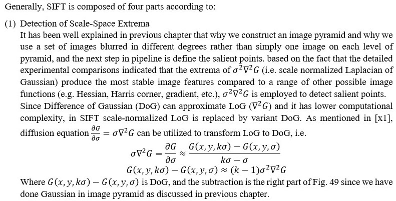
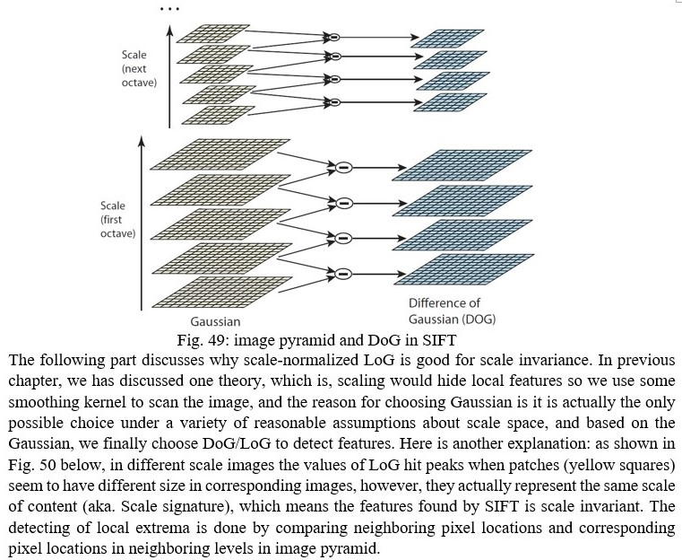
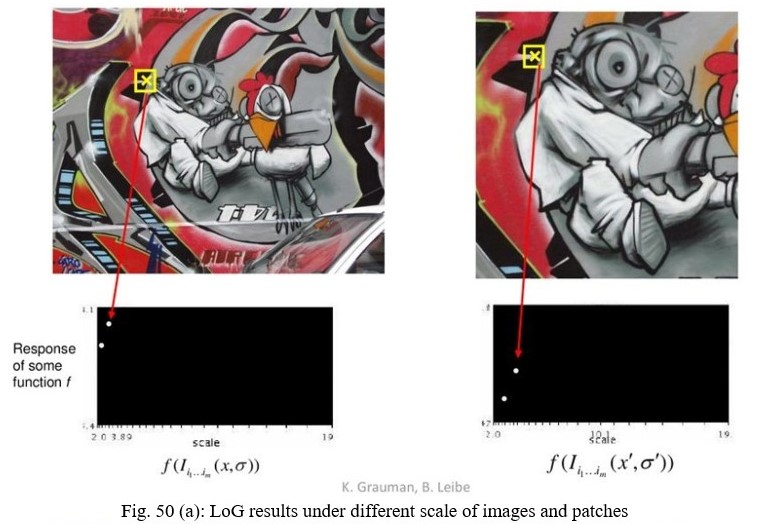
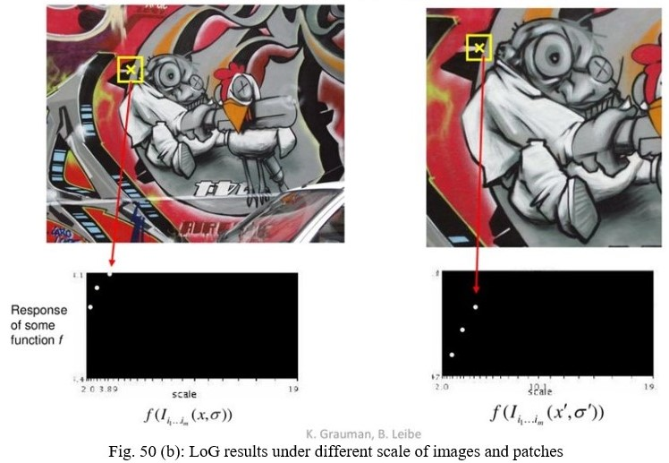
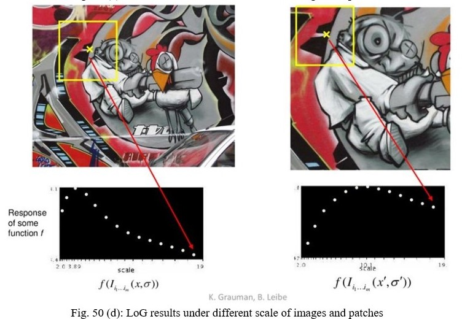
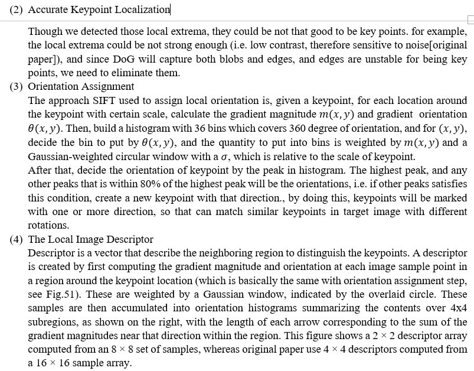
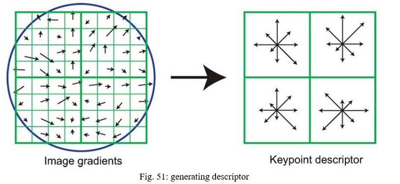
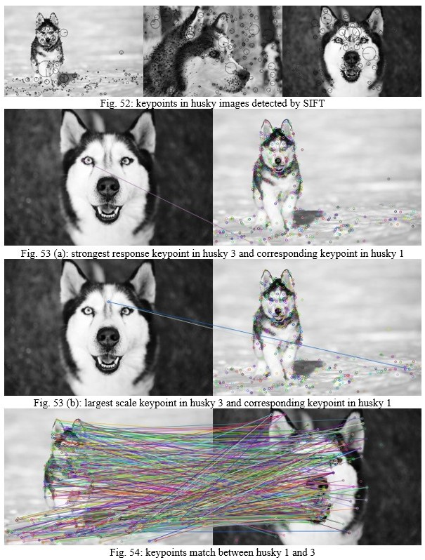
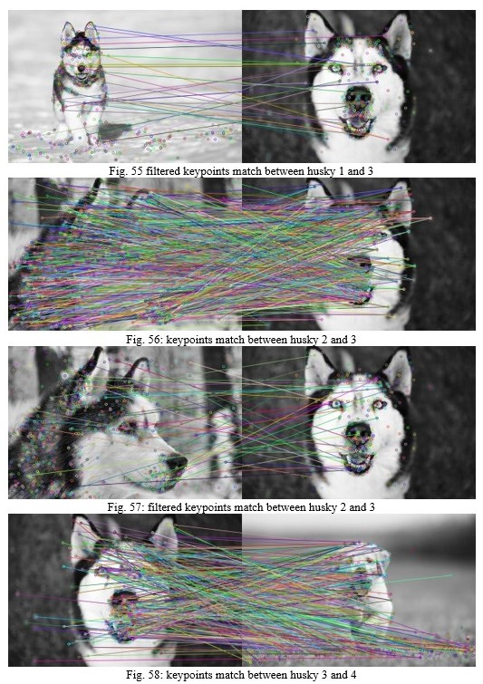
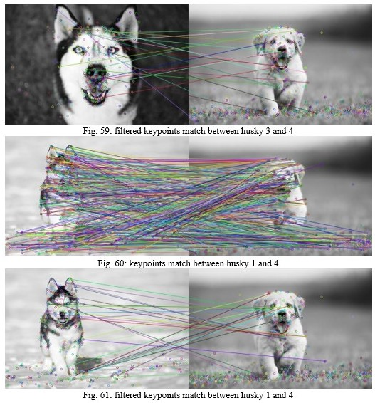

# Image matching by SIFT

This project matches images features by SIFT. Explanation of SIFT will be explained in detail in next chapter, with a few result of the code to show the performance of SIFT.

### SIFT

### A Few Examples

